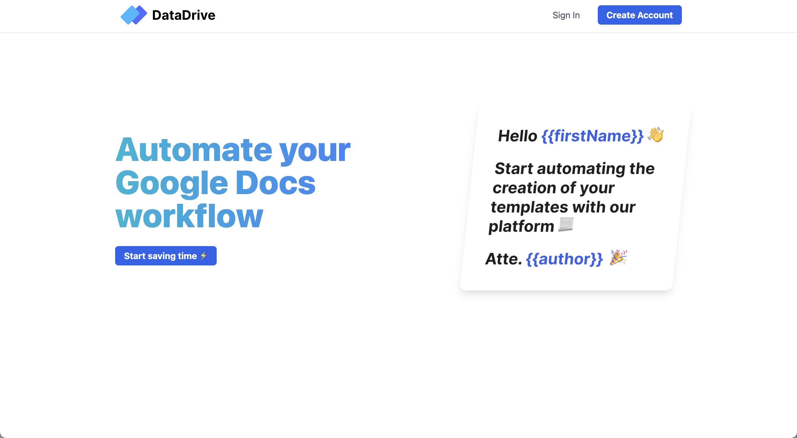
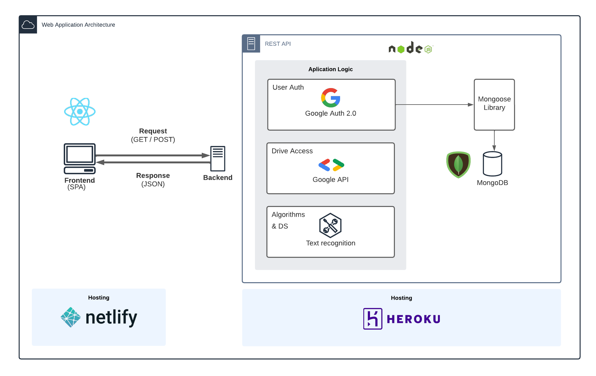

# Data Drive (Frontend) 📝 💻
## Take a look of the code base of the this MVP (MERN). 
This is a dynamic website implemented with React / Tailwind / React Router / Framer Motion / Context API.

The problem that this app solves?
At work I am required to create templates on google drive, update the placeholders and download a pdf with the updated version... Too much right? I decided to write an app that automates this process for me. 🧠

**_IMPORTANT NOTE 1_**: The backend of this web app can be found 
<a href="https://github.com/MIKEGUIJARRO/DataDriveBackend" target="_blank"> 
   here.
  </a>
<h2 align="center">
  
  
   
</h2>

## Web app architecture 🏗
<h2 align="center">
  
   
</h2>

## Features 💡
⚡️ Cookie session\
⚡️ Google Auth 2.0\
⚡️ Protected routes\
⚡️ Global State Management with Context API\
⚡️ Fully responsive\
⚡️ Dope animations 🔥
⚡️ Deployed on Netlify

To view this webpage, **[click here](https://datadrive.netlify.app/)**.

## Technologies used 🛠️
- [React](https://reactjs.org/) - A JavaScript library for building user interfaces
- [React Router](https://reactrouter.com/) - Client-side routing for react
- [Tailwind](https://tailwindcss.com/) - Front-end utility-first CSS framework 
- [Hero Icons](https://heroicons.com/) - Nice open source icons
- [Framer Motion](https://www.framer.com/motion/) - Motion library for React
-  [Netlify](https://www.netlify.com/) - Cloud computing company that offers hosting

## Other resources 🧬
- [DataDrive API](https://github.com/MIKEGUIJARRO/DataDriveBackend) - Backend github repository

## Extra Info 👀
I was motivated to build this project because I wanted to speed up my work's pipeline. I work as a technology coordinator and I am required to create and share a lot of pdf files that most of the time come from a "premade template". I thought it was going to be cool to automate this process and use it for my daily work. ⚡️